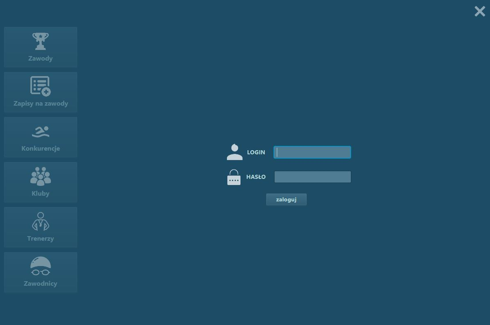
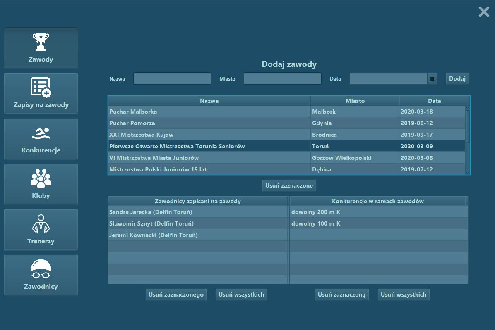
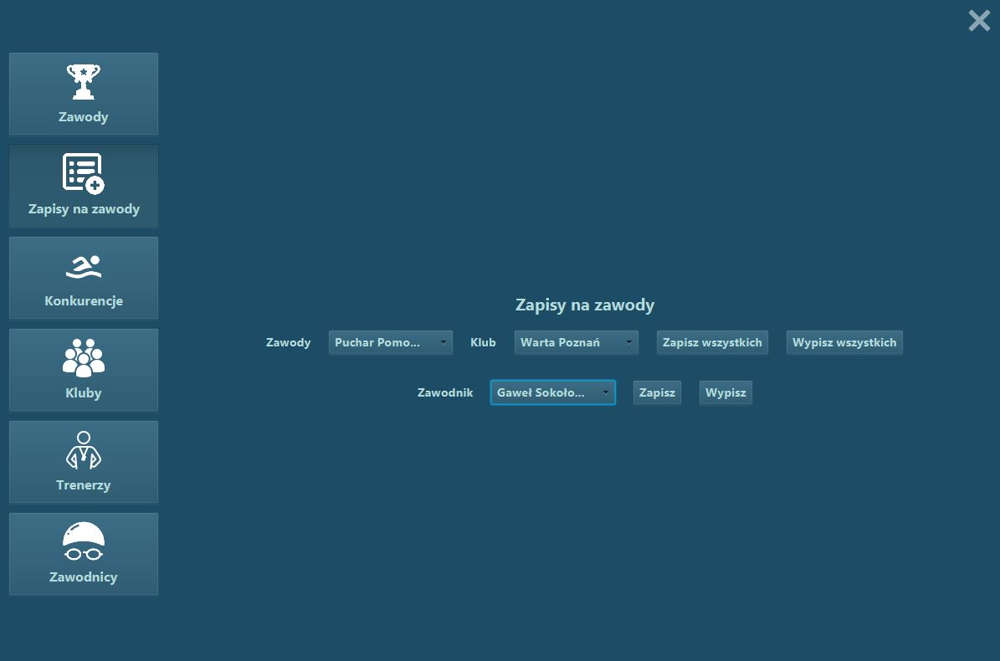
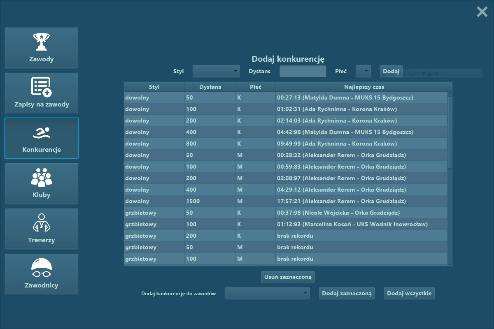
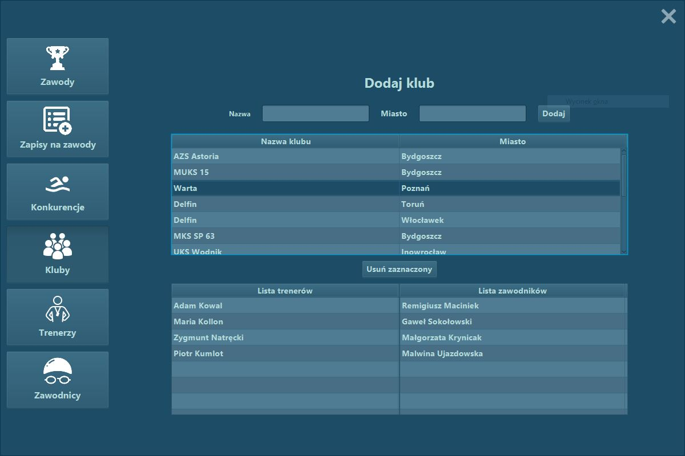
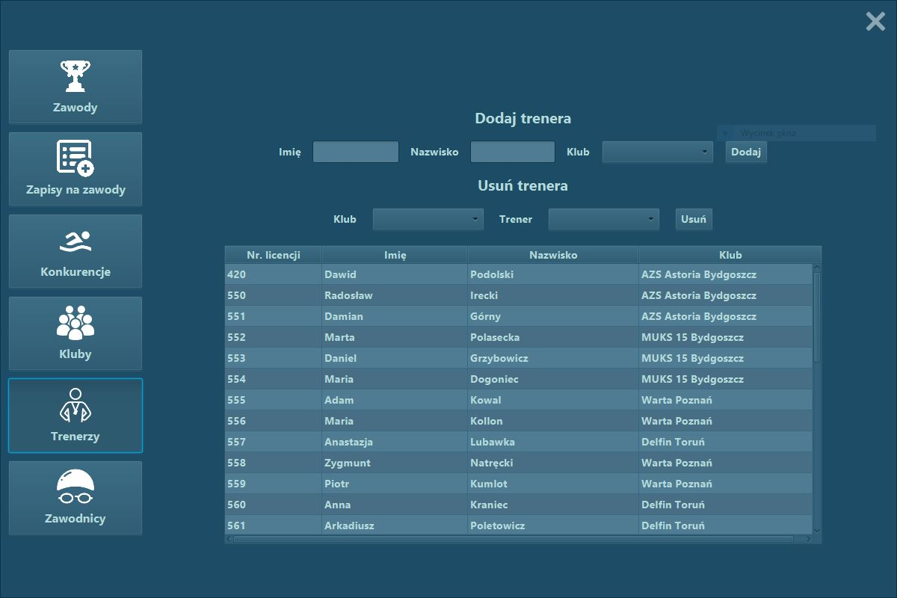
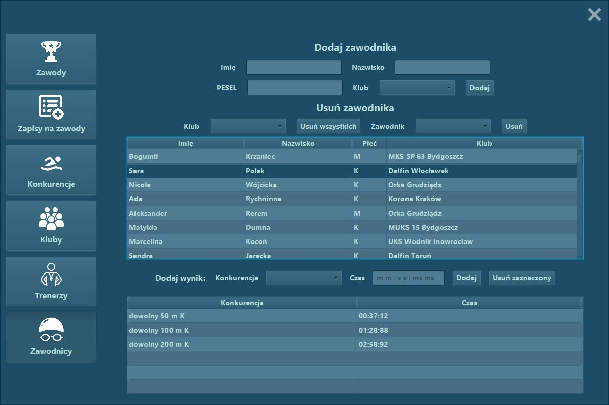

# Swimming Contests Manager Client

Desctop app in the Swimming Contests Manager project to pass the `Programming III` and `Database project` subjects.

This is a simple example of a desctop application for managing a database using REST API from own [server](https://github.com/DuDiiC/swimming-contests-manager-server-app).

The project was created using **Java 8** with the **JavaFX** to create cross-platform desctop applications.

## Full description of the functionality

- browsing existing contests with registered competitors and competitions
- adding, removing and managing contests
- registering and removing competitors from contests
- browsing competitions with records obtained in them
- adding, removing competitions and adding them to contests
- adding, removing clubs and browsing them with trainers and players
- adding, removing and managing competitors (adding records, singing up for the contests)
- adding and removing trainers

## Screens from application:

1. Login screen

2. Contests screen

3. Registration screen

4. Competitions screen

5. Clubs screen

6. Trainers screen

7. Competitors screen

